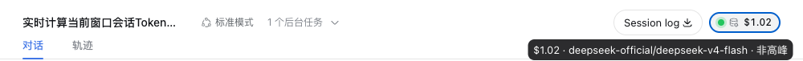
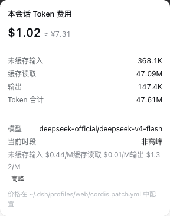
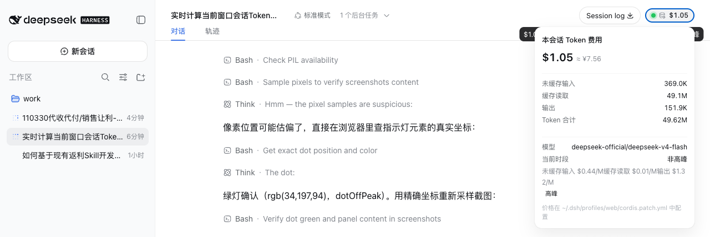

# dsh-token-cost

实时计算 DeepSeek Harness 当前会话 token 消耗金额的插件。

A real-time token-cost meter plugin for DeepSeek Harness: shows the current
session's cumulative spend in the session header, updating live while a turn
streams.

## 功能 / Features

- **服务端投影**（`lib/index.js`）：注册 `tokenCost` 会话投影。回放每个会话日志，把提供方上报的每次用量（未缓存输入、缓存读取、缓存写入、输出）按模型单价折算成美元，并支持 DeepSeek 峰谷时段计价（按事件本地小时判定，默认高峰 9:00–12:00 / 14:00–18:00）。
- **客户端药丸**（`lib/client.js`）：会话头部右侧的费用小药丸实时显示累计花费；点击弹出明细（token 拆分、模型、当前时段、生效单价、峰/非高峰标记）。药丸带**高峰指示灯**：当前处于价格高峰时段亮**红灯**，非高峰亮**绿灯**（按本地时钟每 30 秒刷新，跨整点自动翻转）。
- 实时性：`assistant/chunk` 的 usage 分片在流式输出途中即推送，金额随生成过程实时跳动；同一 `(turn, step)` 的最终用量替换早前样本，不重复计数。
- 价格表完全可配置（`cordis.patch.yml`），无需改代码。

## 界面预览 / Screenshots

会话头部右侧的费用药丸，左侧指示灯实时反映当前计价时段（**非高峰绿灯**，高峰时段变**红灯**）：



点击药丸弹出费用明细面板（token 拆分、模型、当前时段、生效单价）：



实际效果（头部 + 弹出面板）：



> 说明：截图为非高峰时段（绿灯）示例；高峰时段（本地时间 9:00–12:00 / 14:00–18:00）指示灯与“当前时段”显示为红色高峰。

## 安装 / Installation

对任何 DeepSeek Harness Desktop 用户（同样适用于 CLI `dsh web`）。三种方式任选其一。

### 🚀 方式一：对话安装（最省事，推荐）

把下面这段提示词**原样复制**到 DeepSeek Harness 的输入框并回车，让 AI 自动帮你完成安装（需要 git 与写 `~/.dsh` 的权限，被沙箱拦截时按提示放行即可）：

```text
请帮我在 DeepSeek Harness 中安装 dsh-token-cost 插件（会话头部实时显示
token 费用，高峰时段红灯、非高峰绿灯，点击可看明细）：

1. 执行 git clone https://github.com/knightzz1998/dsh-token-cost.git 到本地
   （如 ~/dsh-token-cost）
2. 进入仓库目录，执行 bash install.sh
   （脚本会把插件链接进 web profile 并在 cordis.patch.yml 写入 token-cost 配置行；
    若文件被沙箱拦截，请申请更高权限后重试）
3. 若 install.sh 不存在或执行失败，请手动完成：把仓库链接到
   ~/.dsh/profiles/web/node_modules/dsh-token-cost，并在
   ~/.dsh/profiles/web/cordis.patch.yml 中加入 id: token-cost 的 loader 行
4. 完成后告诉我：安装完成，请重启 DeepSeek Harness Desktop 生效
```

### ⚡ 方式二：一键脚本

```sh
git clone https://github.com/knightzz1998/dsh-token-cost.git
cd dsh-token-cost
bash install.sh        # 幂等，可重复执行；DSH_HOME/DSH_PROFILE 可覆盖默认值
```

### 🛠️ 方式三：手动安装

1. 拿到插件源码：

   ```sh
   git clone https://github.com/knightzz1998/dsh-token-cost.git
   cd dsh-token-cost
   ```

2. 让 web profile 的 loader 能解析到它（二选一）：

   ```sh
   # 方式 A：pnpm 安装（在 profile 目录里）
   cd ~/.dsh/profiles/web && pnpm add file:/绝对/路径/dsh-token-cost

   # 方式 B：直接符号链接
   mkdir -p ~/.dsh/profiles/web/node_modules
   ln -sfn /绝对/路径/dsh-token-cost ~/.dsh/profiles/web/node_modules/dsh-token-cost
   ```

3. 在 `~/.dsh/profiles/web/cordis.patch.yml` 中加入 loader 行（含价格表，按需修改）：

   ```yaml
   - insert:
       - id: token-cost
         name: 'dsh-token-cost'
         config:
           currency: USD
           cnyUsdRate: 7.2          # >0 时在明细弹层里显示 ≈¥ 换算；0 关闭
           default:                  # 未知模型的回退价
             input: 0.22
             cacheRead: 0.007
             cacheWrite: 0.22
             output: 0.66
             peak:
               input: 0.44
               cacheRead: 0.014
               cacheWrite: 0.44
               output: 1.32
           models:
             deepseek-official/deepseek-v4-flash:
               input: 0.22
               cacheRead: 0.007
               cacheWrite: 0.22
               output: 0.66
               peak:
                 input: 0.44
                 cacheRead: 0.014
                 cacheWrite: 0.44
                 output: 1.32
           peakHours: [[9, 12], [14, 18]]    # 高峰时段（本地时间/北京时间）；[] 关闭峰谷价
   ```

4. **重启 DeepSeek Harness Desktop**（loader 与客户端模块扫描在启动时缓存），刷新后任意有用量的会话头部右侧即可看到费用药丸。

## 配置说明 / Configuration

- 单价单位：美元 / 每 1,000,000 token。
- 查找顺序：`models["<provider>/<model>"]` → `models["<model>"]` → `default`。
- `peak` 为可选高峰价；样本事件时间落在 `peakHours` 窗口内且模型声明了 `peak` 时使用高峰价，否则用基础价。`peakHours` 按**本地时间**书写（中国用户即北京时间，DeepSeek 高峰 = 9:00–12:00 / 14:00–18:00）；指示灯的“当前高峰”判断使用同一配置，设为 `[]` 即关闭峰谷价，指示灯恒为绿灯。
- 默认价格对应 [DeepSeek 官方定价](https://api-docs.deepseek.com/quick_start/pricing/) 的 deepseek-v4-flash（非高峰 / 高峰）。请以你的实际账单为准调整。
- 计费口径与 dsh-token-meter 的 `tokenUsage` 投影一致：未缓存输入 × input、缓存读取 × cacheRead、缓存写入 × cacheWrite、输出 × output。

## 工作原理 / How it works

- 服务端通过 `ctx.inject(["sessionProjections"], …)` 注册一个纯折叠投影单元（`ProjectionDefinition`），由会话投影框架在事件落盘时驱动，快照走既有检查点缓存。
- 客户端通过标准套件的 `useProjection("tokenCost")` 订阅该键；投影帧一到即重渲染，因此无需任何轮询。

## 已知限制 / Limitations

- 价格表在插件启动时捕获，修改 `cordis.patch.yml` 需重启生效。
- 同一 (turn, step) 内若中途切换模型，替换样本按最新模型单价计价（极少见，误差可忽略）。
- 客户端设置页的「插件配置」标签需要 api-proxy 白名单，本插件暂未接入，价格请在 `cordis.patch.yml` 中维护。

## License

MIT
